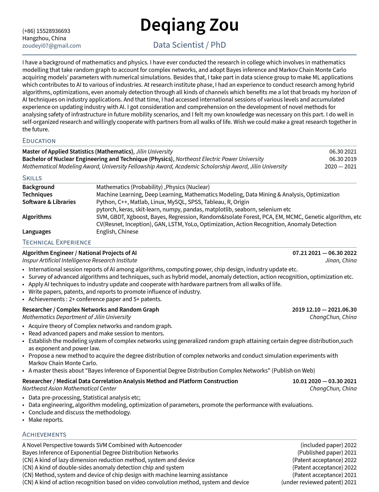

# Achievements 
Achievements of academic on papers, patents, researches, etc 

## papers 

### Bayesian Inference of the Exponential Degree Distribution Complex Networks 
The exponential degree distribution has been found in many real world complex networks other than the power law, based on which, the accurate identification of exponential patterns is a significant consequence for exactly modeling complex systems. Nonetheless, the commonly used methods of analyzing exponential complex networks are barely approved in that somehow produce inaccurate estimate of exponents over the exponential distribution. In this paper, we introduce generalized random graph theory as the framework to account for the degree distribution of the complex network which follows an exponential, analyzing the derivation of the exponent with rigorous proofs. And then, we take advantage of Bayes inference to acquaint the optimal exponent both in simulated data and empirical data with the help of Markov Chain Monte Carlo (MCMC). Eventually, we conduct the Kolmogorov-Smirnov tests of goodness-of-fit to exponential distributions in empirical data, in which, the exponential exponents are estimated with Bayes-MCMC, presenting an efficient and robust analytical way in complex networks.

### Multi-Clue Sparse 3-Dimensional Convolutional Networks on action recognition
The current approaches of deep neural network lack capacity on action recognition, yet ineffective structure for spatiotemporal feature learning, and heavy parameters of architecture are even harsh to optimize. In this paper, we propose Muti-Clue Sparse 3-Dimensional Convolutional Networks(MS3D Convnet) based on landmark works that aims to make it far known in this field. The MS3D Convnet enhances channels of input through low, medium, and fast pathways with disparate frames of video, frame sequences considering as temporal clue sampled in terms of variance rate of action. The frames of each pathway are convolved with commonly shared kernels forming cohorts as initial results, and pile up three-way cohorts to the 3D block transmiting to subsequent 3D network. The 3D network is modified by Densenet architecture with randomly dropping out connections among the layers, and introduces 3D convolutional kernels to deal with temporal information, eventually generating 256-dimension codes of actions. Action recognition employs centers of vector clusters of actions instead of stubborn format, which provide a robust convergence environment. Spontaneously, the MS3D ConvNet fosters capacity of action information and hardly ever sustains heavy amounts of parameters which deserves double profits. This fancy structure also leaves an end-to-end fashion training and a possibility to pre-train parameters. Besides that, we devise tailor strategy based on yolo algorithm to endow disparate factors on pixels in compliance with bounding box frontier, regarded as the means of attention. The MS3D Convnet has been applied to three public action datasets and a self-defined dataset, which performs advanced steps on accuracy, convergence, and robustness.

### A Novel Perspective towards SVM Combined with Autoencoder 
In this paper, we propose a novel perspective towards the hybrid algorithm about support vector machine combined with neural network. We suggest that the depth of convolution neural network is supposed to insight the view of machines to acquiring an equal level of features as human do. The kernel function of support vector machine can be grasped flexibly where the neural network makes an efficient cross calculation for features exactly instead of the kernel function but more adjustable. To develop such a coincident format, we build a hybrid model with the half former part of autoencoder working as the kernel function and support vector machine working as the core classifier, with certain ways to train the hybrid model: discrete, continuous and prejudice. The hybrid model inherits asset of each algorithm, and that process is generally subject to the objective perspective. We take the hybrid model to Covid 19 detection compared with other well-performed models, and experimental results illustrate that our perspective is advisable which achieves a state-of-the-art performance in medical scheme.

## patents

(CN) A kind of lazy dimension reduction method, system and device (Patent acceptance)  2022  
(CN) A kind of double-sides anomaly detection chip and system (Patent acceptance) 2022  
(CN) Method, system and device of chip design with machine learning assistance (Patent acceptance) 2021  
(CN) A kind of action recognition based on video convolution method, system and device 2022   

